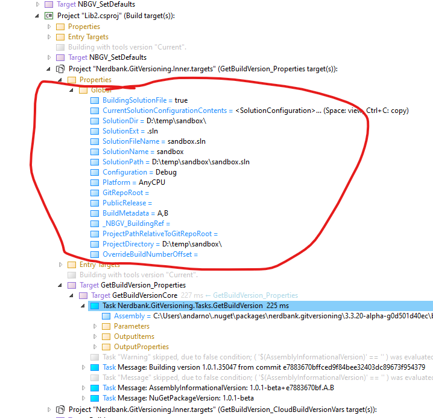

# MSBuild

Installing the `Nerdbank.GitVersioning` package from NuGet into your MSBuild-based projects is the recommended way to add version information to your MSBuild project outputs including assemblies, native dll's, and packages.

If you want the package to affect all the projects in your repo, and you use `PackageReference` (rather than `packages.config`),
you can add this to a repo-level `Directory.Build.props` file:

```xml
<ItemGroup>
  <PackageReference Include="Nerdbank.GitVersioning"
                    Version="(latest-version-here)"
                    PrivateAssets="all"
                    Condition="!Exists('packages.config')" />
</ItemGroup>
```

The condition prevents the `PackageReference` from impacting any `packages.config`-based projects
such as vcxproj that may be in your repo.
Such projects will require individual installation of the Nerdbank.GitVersioning nuget package
using the NuGet Package Manager in Visual Studio.

## Public releases

By default, each build of a Nuget package will include the git commit ID.
When you are preparing a release (whether a stable or unstable prerelease),
you may build setting the `PublicRelease` global property to `true`
in order to avoid the git commit ID being included in the NuGet package version.

From the command line, building a release version might look like this:

```ps1
msbuild /p:PublicRelease=true
```

Note you may consider passing this switch to any build that occurs in the
branch that you publish released NuGet packages from.
You should only build with this property set from one release branch per
major.minor version to avoid the risk of producing multiple unique NuGet
packages with a colliding version spec.

## Customization through MSBuild

### Properties

The following MSBuild properties may be set in your project to customize certain Nerdbank.GitVersioning behaviors:

Property | Default | Description
--|--|--
`NBGV_ThisAssemblyNamespace` | (empty) | Sets the namespace to use for the generated `ThisAssembly` class.
`NBGV_EmitThisAssemblyClass` | `true` | When `false`, suppresses generation of the `ThisAssembly` class.
`NBGV_ThisAssemblyIncludesPackageVersion` | `false` | When `true`, a `NuGetPackageVersion` property is added to the `ThisAssembly` class.

### Custom `ThisAssembly` static fields and constants

Custom constants may be added to the `ThisAssembly` class through `AdditionalThisAssemblyFields` items defined in your project.
The item name becomes the constant's name. The value of the constant may be defined by metadata whose name determines the type of the constant as follows:

Metadata name | Property type | Notes
--|--|--
`String` | `string` | These may also carry `EmitIfEmpty="true"` metadata to force generation of the constant even if the string value is empty.
`Boolean` | `bool` |
`Ticks` | `DateTime` | The integer specified in msbuild metadata will be interpreted as ticks to construct the `DateTime` value.

For example, to the following MSBuild items:

```xml
<ItemGroup>
  <AdditionalThisAssemblyFields Include="FinalRelease" Boolean="true" />
  <AdditionalThisAssemblyFields Include="MyMessage" String="Hello World" />
  <AdditionalThisAssemblyFields Include="AGoodMoment" Ticks="638300335845163552" />
</ItemGroup>
```

Will add the following constants or static fields to the `ThisAssembly` class:

```cs
internal const bool FinalRelease = true;
internal const string MyMessage = "Hello World";
internal static readonly DateTime AGoodMoment = new System.DateTime(638300335845163552L, System.DateTimeKind.Utc);
```

### Custom build authoring

If you are writing your own MSBuild targets or properties and need to consume version information,
Nerdbank.GitVersioning is there to help.
The version information created by this package is expressed as MSBuild properties.
These properties are set by the `GetBuildVersion` target defined in this package.
This means any dependency you have on these properties must ensure this target has already executed.
This can be done by defining your own msbuild target like so:

```xml
<Target Name="MyPropertySetter" DependsOnTargets="GetBuildVersion">
  <PropertyGroup>
    <MyOwnProperty>My assembly version is: $(AssemblyVersion)</MyOwnProperty>
  </PropertyGroup>
</Target>
```

In the above example, the `AssemblyVersion` property, which is set by the
`GetBuildVersion` target defined by Nerdbank.GitVersioning, is used to define
another property.
It could also be used to define msbuild items or anything else you want.

Note that in the simple example above, `MyPropertySetter` will not execute unless explicitly requested from the command line with a `/t:MyPropertySetter` switch.
If you want your target to run as part of a build by default, you will need to add attributes to the `Target` or set other properties that influence existing targets to depend on this one.
For example, you might add `BeforeTargets="CoreCompile"` if your target sets properties that will be consumed by the compiler.
[Learn more about custom MSBuild targets from the Microsoft documentation](https://learn.microsoft.com/visualstudio/msbuild/msbuild-targets).

### MSBuild properties defined in `GetBuildVersion`

Many MSBuild properties are set by `GetBuildVersion` allowing you to define or redefine
properties in virtually any format you like.
The authoritative list is [here](https://github.com/dotnet/Nerdbank.GitVersioning/blob/dae20a6d15f04d8161fd092c36fdf1f57c021ba1/src/Nerdbank.GitVersioning.Tasks/GetBuildVersion.cs#L300-L323) (switch to the default branch to see the current set).

Below is a snapshot of the properties with example values.
Note that the values and formats can vary depending on your `version.json` settings and version height.

Property | Example value
--|--
AssemblyFileVersion | 2.7.74.11627
AssemblyInformationalVersion | 2.7.74-alpha+6b2d14ba68
AssemblyVersion | 2.7.0.0
BuildingRef | refs/heads/fix299
BuildNumber | 74
BuildVersion | 2.7.74.11627
BuildVersion3Components | 2.7.74
BuildVersionNumberComponent | 74
BuildVersionSimple | 2.7.74
ChocolateyPackageVersion | 2.7.74-alpha-g6b2d14ba68
CloudBuildNumber | (empty except in cloud build)
FileVersion | 2.7.74.11627
GitCommitDateTicks | 637547960670000000
GitCommitId | 6b2d14ba6844d2152c48268a8d2c1933759e7229
GitCommitIdShort | 6b2d14ba68
GitVersionHeight | 74
MajorMinorVersion | 2.7
NPMPackageVersion | 2.7.74-alpha.g6b2d14ba68
NuGetPackageVersion | 2.7.74-alpha-g6b2d14ba68
PackageVersion | 2.7.74-alpha-g6b2d14ba68
PrereleaseVersion | -alpha
PublicRelease | False
SemVerBuildSuffix | +6b2d14ba68
Version | 2.7.74-alpha-g6b2d14ba68

## Build performance

Repos with many projects or many commits between major/minor version bumps can suffer from compromised build performance due to the MSBuild task that computes the version information for each project.
You can assess the impact that Nerdbank.GitVersioning has on your build time by running a build with the `-clp:PerformanceSummary` switch and look for the `Nerdbank.GitVersioning.Tasks.GetBuildVersion` task.

### Reducing `GetBuildVersion` invocations

If the `GetBuildVersion` task is running many times, yet you have just one (or a few) `version.json` files in your repository, you can reduce this task to being called just once per `version.json` file to *significantly* improve build performance.
To do this, drop a `Directory.Build.props` file in the same directory as your `version.json` file(s) with this content:

```xml
<Project>
  <PropertyGroup>
    <GitVersionBaseDirectory>$(MSBuildThisFileDirectory)</GitVersionBaseDirectory>
  </PropertyGroup>
</Project>
```

This MSBuild property instructs all projects in or under that directory to share a computed version based on that directory rather than their individual project directories.
Check the impact of this change by re-running MSBuild with the `-clp:PerformanceSummary` switch as described above.

If you still see many invocations, you may have a build that sets global properties on P2P references.
Investigate this using the MSBuild `/bl` switch and view the log with the excellent [MSBuild Structured Log Viewer](https://msbuildlog.com) tool.
Using that tool, search for `$task GetBuildVersion` and look at the global properties passed to the special `Nerdbank.GitVersioning.Inner.targets` project, as shown:

[

Compare the set of global properties for each `Nerdbank.GitVersioning.Inner.targets` project to identify which properties are unique each time.
Add the names of the unique properties to the `Directory.Build.props` file:

```xml
<Project>
  <PropertyGroup>
    <GitVersionBaseDirectory>$(MSBuildThisFileDirectory)</GitVersionBaseDirectory>
  </PropertyGroup>
  <ItemGroup>
    <NBGV_GlobalPropertiesToRemove Include="ChangingProperty1" />
    <NBGV_GlobalPropertiesToRemove Include="ChangingProperty2" />
  </ItemGroup>
</Project>
```

That should get you down to one invocation of the `GetBuildVersion` task per `version.json` file in your repo.
